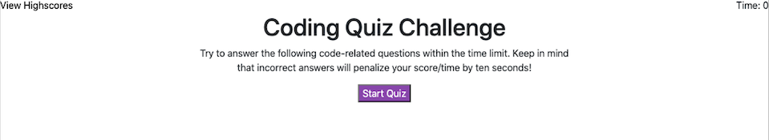

# quiz
This project is a timed code quiz that consists of 5 questions!
The common for all pages is the content of the top of the page (like a nav-bar), which sow the timer in the right top corner and the High Scores in the left top corner (tis page link the user to high-scores.html file). Also, all the content of the page is centered. 
 

The quiz begin on the start-quiz.html page. On the content of this page is displayed an informative paragraph and a button which on click start the timer and run the quiz questions. 

When the user begins the quiz, for each question are available for answers, one of which is correct. If the user chose a wrong answer, 10 seconds from the time are subtracted. the user is informed if the selected choice was correct or wrong under the choices of the next question. 

After the last question, the user is directed to initials.html page. There, the user is informed what is the gathered score and is asked to introduce the initials. 

The last page is the high-scores.html which displays all users scores. On this page are situated two buttons. The "Go Back" button link the user to the start-quiz page. The "Clear Highscores" button clear all the high scores history. 

#Deployment

https://mihaelavalac.github.io/quiz/

